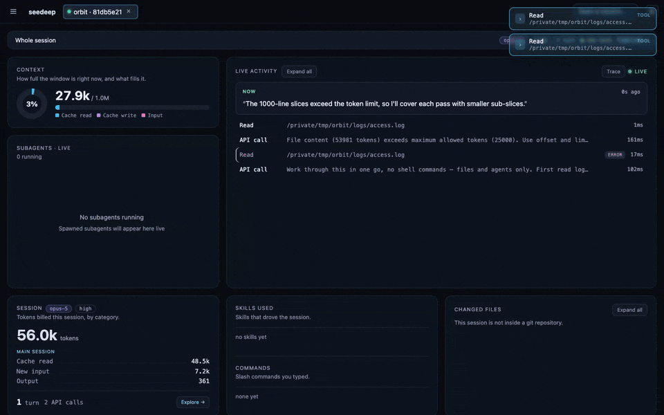
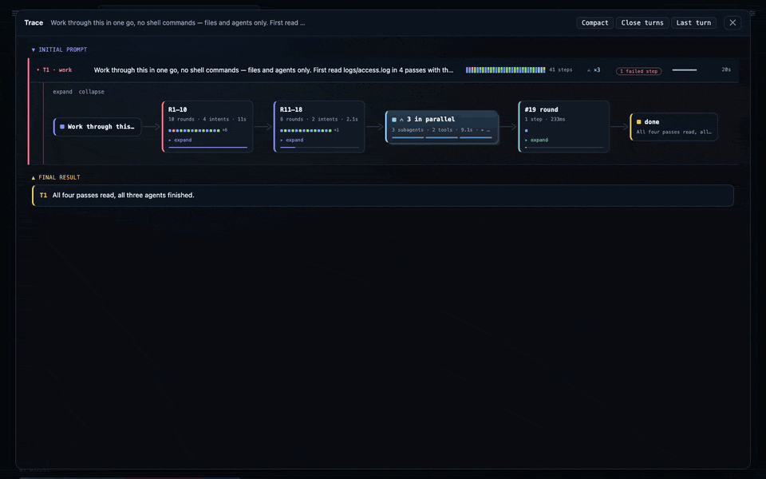
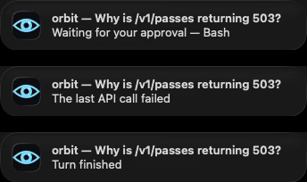
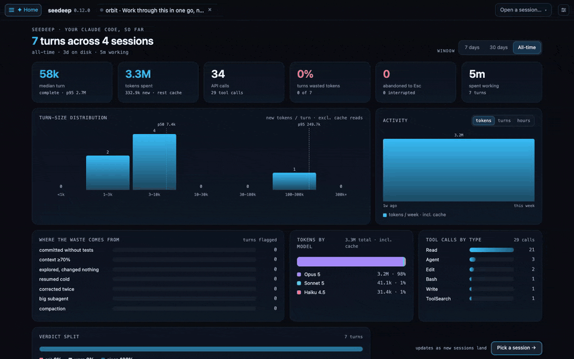
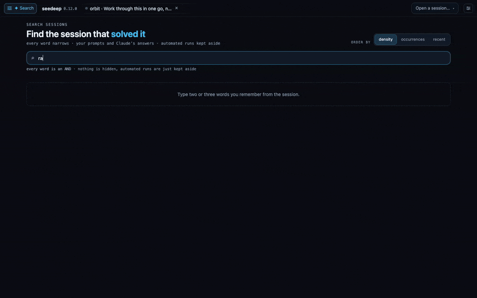

<div align="center">


# seedeep

### *See deep into your agent's context.*

[](https://www.npmjs.com/package/seedeep)
[](LICENSE)


**A Claude Code turn tells you nothing while it runs, and no more when it ends.**

You send a prompt and the terminal shows a spinner. Behind it the window fills,
subagents spawn and spend it on models of their own, the same context is read
again on every call, and a compaction quietly deflates the lot. Minutes later an
answer arrives, with no account of what it cost or which part of it was waste.

`seedeep` records the whole chain **while it is still running** — your prompt,
every call to the model with its latency and its own input and output, every tool
it fired and what came back, each subagent's work folded under the spawn that
launched it, down to the answer you read. One continuous flow, live during the
turn and still there to walk through afterwards. All of it from the logs Claude
Code already writes on your machine: **read-only, no proxy, no daemon, nothing
sent anywhere.**



*Your last turn looked like a spinner. This is what it was doing: 3% → 26% of the
window, six subagents on three different models, 2.9M tokens billed — 2.5M of them
the same context read again.*

</div>

---

## Why you'd run it

Every line below is something your session does not tell you, and what `seedeep`
does about it instead.

- **A session died and never said so.** A failed API call — an expired login, a
  session limit, an overloaded server — ends the turn and leaves it sitting there:
  measured over 1830 real transcripts, **39 of 47 failed calls were the last thing
  their session ever wrote.** seedeep turns the tab red, files the session under
  *Broken*, and the menu-bar icon goes red above every other signal.
- **A session has been waiting on you for ten minutes.** An approval dialog reaches
  no log at all, so a stopped session looks exactly like a thinking one. seedeep
  reads Claude Code's own live state and turns the tab amber the moment it stops,
  saying what it is waiting to approve.
- **A subagent is spending the window you needed.** The live tree shows each one as
  it launches — its own context filling, the model it actually runs on, and the
  verbatim output it handed back to the main session.
- **The window is not the size you assume.** The bar follows the model your calls
  really run on, so `/model` mid-session moves it, and a Haiku subagent is measured
  against 200k while the session around it runs on 1M.
- **The turn that paid to come back.** A turn resumed after the cache went cold
  re-creates its whole prompt before doing any work — on a real corpus that is **a
  quarter of every token spent**, and it looks exactly like work.
- **Waste you would otherwise reconstruct by hand.** Seven deterministic checks
  (no LLM) score every turn as it closes, each quoting the Claude Code
  documentation that justifies it — and they name what the turn did right too.
- **What the call actually cost.** Every API call in the feed with its latency, its
  input and output on demand, and the split between cached context and what was new.
- **What the session shipped.** The commits and the tracker cards it produced, read
  from the calls that made them, never from a key typed in a prompt.

`seedeep` is under active development. **[The complete tour of every
surface →](docs/features.md)**

## What it looks like

Every capture below is a **synthetic session** on a fictional project — no real
path, prompt or project name appears in any frame.

### The Trace — the turn's shape, while it is still happening



Each turn as a row: how many steps it took, how long it ran, whether a step failed,
and the subagent rounds it spawned. It fills in as the session works — this is not a
report produced afterwards. ([rules](docs/trace.md))

### The tray — the same session, from the menu bar


A native menu-bar client, polling the same local server. It says what the session is
doing right now, which subagents are running and on which model, and how full the
window is — without a browser tab open. ([rules](docs/tray.md))

### The notifications — the reason to have a tray at all



Three things about a session are worth interrupting you for, and each has its own
switch. Nothing else notifies: not a subagent finishing, not a tool error. A tray
that notifies about everything is a tray you mute.

| Banner | Ships | Why |
| -- | -- | -- |
| **Waiting for your approval** | on | the session cannot go on until you answer |
| **The last API call failed** | on | it has stopped, and nothing on screen says so — 39 of 47 real failures were the last line their session ever wrote |
| **Turn finished** | **off** | news you can read whenever you like should not be able to force you to silence the two that cannot wait |

Each is one title and one line — which session, and what happened. The command
awaiting approval and the error text stay in the panel: you cannot act on a banner,
and the webhook channel sends its payload off your machine.

seedeep ships unsigned, so macOS asks for the notification permission again on every
update — a tray that goes quiet after an upgrade is
[that, not a bug](docs/install.md#installing-the-tray).

### Home — what your sessions have actually cost



Across every session on the machine: turn-size distribution, where the waste came
from, and tokens split by the model that spent them — **subagents counted under their
own model**, so a Haiku explorer inside an Opus session shows up as Haiku.

### Search — finding the session that solved it



Every word narrows. Your prompts and Claude's answers, matches highlighted in place,
ranked by density rather than recency. Paste a commit hash or a tracker id and it
also asks git and its own index — the session that did the work is exactly the one
text search misses. ([rules](docs/search.md))

## How it works

Claude Code appends one line to a local session file per content block — a single
response becomes several — each stamped with its call's token usage. `seedeep` tails
those files and reconstructs the picture — no network interception, no
`ANTHROPIC_BASE_URL` hack, nothing written back. It watches every active Claude Code
session at once, and identifies its own launching session so it never counts itself.

Session data flows one way: the server pushes to the browser over Server-Sent Events,
and nothing seedeep reads is ever written. See
[`docs/architecture.md`](docs/architecture.md) for the full design.

## Install

With Node or Bun, from npm:

```sh
npm i -g seedeep          # or: bun install -g seedeep --trust
seedeep                   # watch, serve, and open the browser
```

**With neither**, take the file for your platform from
[the latest release](../../releases/latest) — macOS arm64/x64, Linux x64/arm64,
Windows x64/arm64 — and run it. **That file is not an installer, it is the program**: it
carries its own runtime and the whole browser GUI inside, installs nothing, and
leaves behind only `~/.seedeep/`. The Linux builds require **glibc** (Debian,
Ubuntu, Fedora and derivatives) — Alpine and other musl-based distributions are
not supported.

The **menu-bar tray** is a separate, optional download from the same release: a
universal `.dmg` for macOS, a `-setup.exe` for Windows. It is a pure client — the
server is what has to run where Claude Code runs. **Both are unsigned**, so macOS and
Windows each show a first-launch warning.

Inside Claude Code, `seedeep install-command` adds a `/seedeep` command that opens
the GUI, stops the server, or reports what the current session cost.

**[Installing, running, updating, remote access and removal in full →](docs/install.md)**

## Which platforms have actually been run

Everything above was checked by hand on **macOS**, on the machine `seedeep` is
developed on. **Linux has been used once**, in a VM, on arm64; **Windows in a VM**,
several times. Building for three systems is not the same as having used three, and
this section is that difference written down rather than left for you to find.

There is a middle ground worth naming: **started is not used**. Every release runs
each server binary on a runner of its own operating system before anything is
published — it must report its version, answer on its API and serve the browser GUI,
or the release stays a draft. That rules out the download that dies at startup. It
says nothing about whether the thing is pleasant, or correct, in front of a person on
that machine.

| | macOS | Windows | Linux |
| -- | -- | -- | -- |
| **Server** — download or npm | Used daily; every claim above was checked here | **Used on Windows 11 in a VM** — installed from npm, server started and served its API against a real Claude Code session, `status`, `stop`, `restart` and `install-command` confirmed, and consecutive cold starts measured without a failure. `/seedeep` there needs one line of configuration ([`install.md`](docs/install.md#seedeep-inside-claude-code)) | **arm64: used on Ubuntu 24 in a VM** — GUI opened against a real Claude Code session, lifecycle and `install-command` confirmed. **x64: exercised on every release, never used by a person** — started, left idle and driven through the full lifecycle in CI, and version-checked on Docker; never run in front of a person. Both builds require glibc; Alpine/musl is not supported. |
| **Tray** | Used daily on a real menu bar | **Installed and used on Windows 11 in a VM** — the installer runs, the icon reads in the notification area, the popover opens at full height, trust-on-first-use and the connection screen work, the panel's buttons respond, notifications are delivered, and no console window appears | **Not a target**, deliberately: Tauri emits no tray click event on Linux, so the panel could not open — see [`docs/tray.md`](docs/tray.md) |

Concretely: on **Linux x64** you are the first to use it. A defect there is expected
rather than surprising, and [an issue](../../issues) saying what you saw is the most
useful thing you can send — every Windows session so far found several, which is the
honest estimate of what an untouched square still holds.

## Design principles

- **Read-only.** `seedeep` only reads what Claude Code already writes. It never
  modifies, proxies, or intercepts your session.
- **Live, not post-hoc.** The point is watching a turn *as it happens*, not analyzing
  spend after the fact.
- **Runtime-agnostic core.** The reducer and every rule it applies are built on standard
  APIs alone — no runtime builtins — so they run and are tested anywhere. The server
  around them is Bun, and ships with it embedded: you never install a runtime to run
  `seedeep`.
- **Local by default.** Nothing leaves the machine unless you ask for it, and asking
  for it turns on TLS and a token in the same move.
- **Visual is the point.** The number is the message; the picture is what makes it
  click.

## Development

The server and the browser GUI are developed against [Bun](https://bun.sh) — no
other runtime required. The menu-bar tray is a Tauri app, so building *it*
additionally needs a Rust toolchain and the platform SDK.

```sh
bun install
bun start          # watch, serve, and open the browser
bun run test       # run the test suite
bun run typecheck  # tsc --noEmit (the tests do not type-check)
bun run tray:dev   # build the tray panel, compile, run
```

If you also run an installed seedeep, develop through `bun run dev` and
`bun run tray:dev`: they give the checkout a state directory and a port of its own.
[`CONTRIBUTING.md`](CONTRIBUTING.md) has the full setup, the conventions, and how to
send a change.

## Docs

| | |
| -- | -- |
| [`features.md`](docs/features.md) | every surface, and the reasoning behind the rules |
| [`install.md`](docs/install.md) | installing, running, updating, remote access, removal |
| [`architecture.md`](docs/architecture.md) | the pipeline, and why it has the shape it does |
| [`api.md`](docs/api.md) | the HTTP reference: every route, its parameters and its responses |
| [`configuration.md`](docs/configuration.md) | the config file, precedence, TLS, auth, the Settings panel |
| [`trace.md`](docs/trace.md) · [`search.md`](docs/search.md) · [`tray.md`](docs/tray.md) | the three surfaces with rules of their own |
| [`session-output.md`](docs/session-output.md) | what a session shipped, worked on, and touched |
| [`claude-code-upgrades.md`](docs/claude-code-upgrades.md) | how seedeep survives a Claude Code release |
| [`CHANGELOG.md`](docs/CHANGELOG.md) | what changed, newest first |
| [`CONTRIBUTING.md`](CONTRIBUTING.md) | hit a bug or want a change? start here — and what to redact before you attach anything |
| [`SECURITY.md`](SECURITY.md) | found a vulnerability? report it privately, never as an issue |
| [`CODE_OF_CONDUCT.md`](CODE_OF_CONDUCT.md) | community standards and how violations are handled |

## License

[MIT](LICENSE) © duqaXxX
