# What seedeep shows

The full tour of every surface, and the reasoning behind the ones whose rules are
not obvious. `seedeep` is under active development; everything on this page is in
the current release.

The README is the short version. The design behind these surfaces is in
[`architecture.md`](architecture.md); what changed when is in
[`CHANGELOG.md`](CHANGELOG.md).

> Every figure below is a **cropped still of a synthetic session** on a fictional
> project, cut by `bun run doc-shots` — never a screenshot somebody took. Most come
> from a real recorded session, replayed. The rest come from a written transcript
> (`apps/server/scripts/doc-scenes.ts`), because some states cannot be provoked on
> request: an API call does not fail when you ask it to, Claude Code refuses to
> compact a small session, and a retrospective is about a corpus rather than a
> session. Those transcripts are synthetic in content and faithful in shape — the
> same rule the test fixtures follow — and each is run through the real parser and
> reducer by a test that asserts the state its figure claims.
>
> Each figure is declared in `apps/server/data/doc-shots.json` with the source files
> that invalidate it, so `bun run doc-shots:check` can name the ones a change may
> have made false. Nothing else can: no test looks at a PNG. What it names are
> **candidates, not verdicts**: the map is per-file and `client/graph.ts` draws every
> widget, so a single edit there names most of them at once (measured on a
> three-line change: 15 named, 20 re-cut, 18 byte-identical). Whether a figure really
> went false is the author's call — did what it *shows* change? — and
> `bun run doc-shots` re-cuts it — `--ids <shot>` for one figure, nothing for all.
> `--verify` settles it by re-cutting the suspects and **comparing the pixels**, but it
> costs minutes, so it belongs to a release rather than to every push.
>
> **A release is not a reason to re-cut anything.** The two Settings figures print the
> server's version, so a release does date them — but a figure documents the surface it
> photographs, not the version that happened to be running, and a stale number in it
> makes nothing it claims false. The only thing that invalidates a figure is a change to
> what it SHOWS.

## The workspace — one tab per session

seedeep is one page holding **a tab per session**, and the strip across the top is
where you find one at a glance. A session that starts gets a tab by itself —
**once**, so one you close stays closed — named `<project> · <first prompt>`, which
is what keeps two sessions of the same project apart. The open set, its order and
which tab is active all survive a refresh.

State is shown rather than spelled, because the words would eat the room the
subject needs: the dot **pulses** while the session is generating, turns **amber**
when it has stopped and is waiting for YOU, and **red** when its last call to the
model failed and nothing has succeeded since. A finished session goes quiet and its
whole tab dims — that is a property of the tab, not a badge on it. The three states
share one dot on purpose: they answer the same question, and a second marker would
turn the strip into a dashboard. Hovering spells out what the classes say, and gives
a cut label its full text back.

To open one that has no tab, the **session picker** — a glass combobox at the end of
the header. Type to filter over the prompt, the model, the project or the id; every
row leads with the session's own first prompt, next to a model chip and how long ago
it ran. Sessions already open are pinned, and the roster splits **Human** from
**Automated**, each side carrying its live count: headless `sdk-*` runs are the bulk
of what a working machine accumulates, and unsplit they bury the handful of sessions
anyone actually picks.

The fixed surfaces — Home, Compare and Search — are not tabs, because a tab is a
session: they live in the header menu (☰), left of the wordmark.

## The live session view

A live-first cockpit: the **Context** card — a dial and a real token breakdown —
next to the live monitor (**Subagents · live**: the running subagents, each with its
context filling in real time and its current action), and the **Live activity** feed
filling the right — the two live signals at a glance. When what the session has
running is background commands rather than subagents, that card is titled
**Running · live** and monitors those instead: same place, same question, whichever
kind of work is in flight.

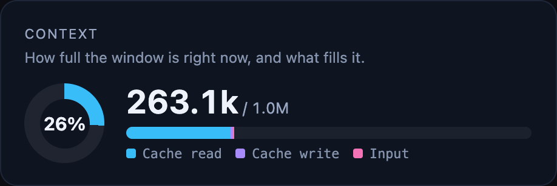

*The number is the whole point, so it is the biggest thing on the card. The bar
below it is the same figure split by what it is made of — mostly context read back
from cache, which is billed too.*

### NOW — what it is doing, in one line

Between the **Live activity** header and the feed sits the panel that answers the
question you actually opened the tab for. Its label says which kind of answer it is:
`now` while something is happening, `output` once the turn's final answer has
landed, `intent` for the words a settled turn left behind, and **`waiting for you`**
when the session has stopped on you.

What it shows, in order of preference, is the agent's own words — the narration it
just wrote, or the turn's result — held long enough to be read and clamped to two
lines, with **more** opening the full text. When there are no words to quote it says
what is true instead of going blank: which tools are running and for how long, or
`Started — no output yet`, or that a subagent is running in the background, or that
one has returned and the turn is working on the result. It deliberately never says
"waiting" for any of those — that word is reserved for the opposite state, the one
where the session is stopped on you.

A turn that is neither running nor left any words behind has no *now* to report, and
the panel is simply not there.

### The activity feed, and every call to the model

The feed interleaves the **API calls** themselves with the tools each one
triggered, every call carrying its latency. Click a call to read its **input and
output** on demand — the model's text and tool args, plus the per-call token split
(cached context vs what was new) and the reasoning **effort** that call ran at,
where Claude Code recorded one.

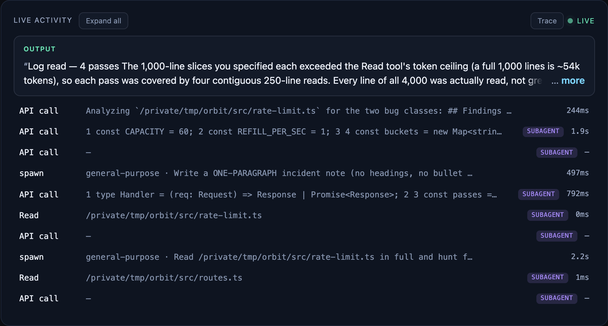

*Read it top to bottom: every `API call` carries the time it took, the tools it
fired sit under it, and anything a subagent did is tagged `SUBAGENT`. The panel at
the top is the model's own last words — the turn's output as it arrives.*

### Toasts — what just happened, without looking away

Two rails announce events as they fire, and they are split by what you do about
them. **Tools and verdicts** rise in a column on the right; **subagent spawns** run
along the bottom, where a fan-out reads as a row rather than as a stampede down one
side. Each rail holds five at most and evicts its oldest, so a burst is bounded by
construction.

They are timed by how much there is to take in: a tool toast is a **1.5s** glance, a
spawn stays **5s** — long enough to also name the **model** it runs on, filled in the
moment that becomes knowable, since three quarters of subagents run on a different
model than the session did — and a verdict announcement holds **8s**.

**Every tool toasts.** The single exception is `Agent`, and it is routing rather
than suppression: a spawn already has the richer toast on the bottom rail, so a bare
`Agent` up top would be the same event twice.

### Which model, and how full that makes it

Whatever scope you are looking at **names the model it ran on** — the banner and
the Session card — because that model *is* the context window's denominator: a
session that switched shows the one in force now and what it was before, so a
changed window can never look like a full one. `/model` mid-session moves the bar,
because 1M and 200k are not the same bar.

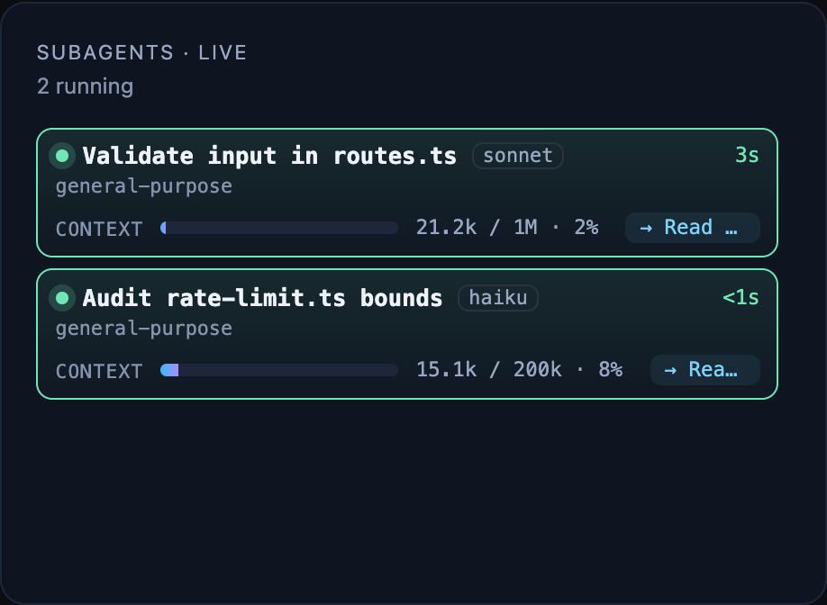

*Three subagents of one turn, and three different denominators: the Haiku one is
measured against 200k while the other two run on 1M. 15.6k is the smallest of the
three figures and the fullest window on the card — which is why a percentage is
worth nothing until you know what it is a percentage of.*

While a turn is open its **elapsed counts up**, and the session states how long it
has **worked** — the sum of its turns, not the wall-clock span. The two differ by
3× in the median session.

### The stats strip

Three equal-height cards: **Session** (tokens by API category plus turn KPIs),
**Skills used** beside **Commands**, and **Changed files**.

In the Session card the main-thread categories are headed *main session*, and the
**Subagents** figure below them opens into a **by-model** bar — the subagent tokens
split by which model actually burned them (charged per call, so a subagent that ran
on two models shows as two), never mixing in the main thread.

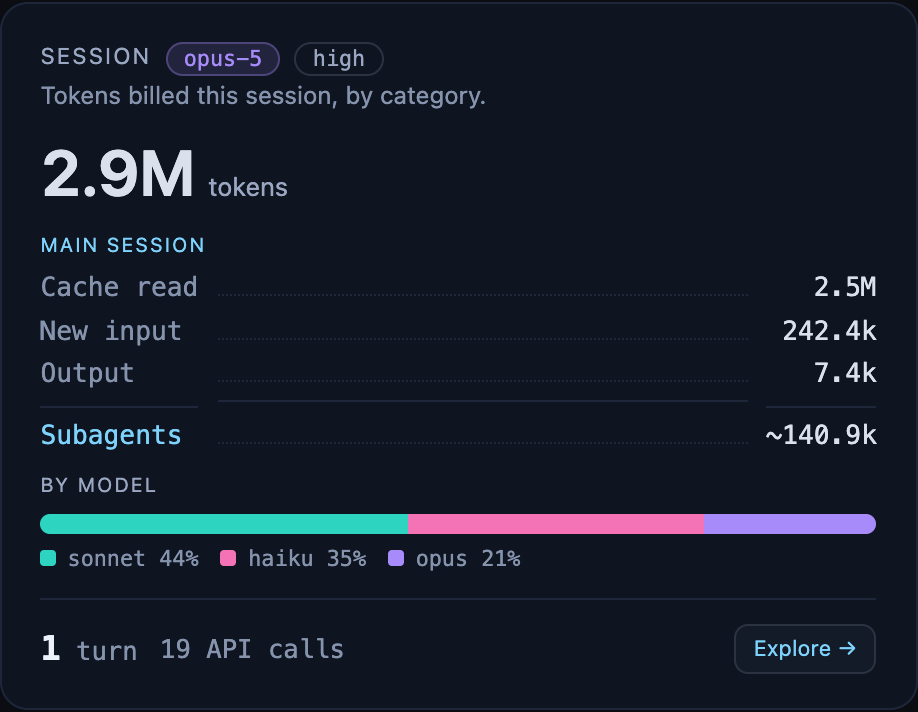

*One turn billed **2.9M** tokens, and **2.5M** of them are context read back from
cache — the figure a session's own footer never shows you. Below it, the subagents'
~140.9k split by the model that actually burned it.*

**Commands** chips are clickable: each opens a drawer listing every turn the
command was typed in, with its per-turn count; clicking a turn scopes the whole
view to it. **Skills** chips open a drawer showing model invocations (times the
model called the Skill tool) and active turns — distinct from user-typed
`/commands`, which appear in Commands.

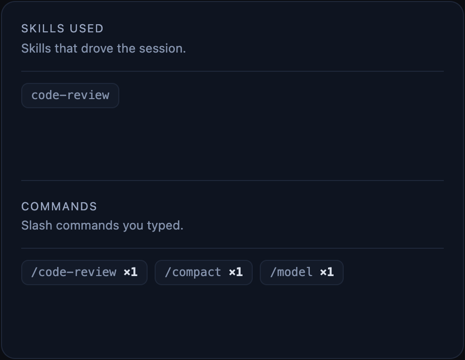

*Two different things, deliberately kept apart: a **skill** the model invoked, and the
**commands you typed**. Each chip opens a drawer listing the turns it appeared in.*

The **Changed files** widget answers *what did this touch*: a total plus a
proportional bar per file extension, counted from **git** — the files of the
commits that session produced, so the number is one you can reproduce with
`git show --stat`. Its description names the commits it counted, and a session that
has not committed says so rather than showing a figure nothing can back.

Counting Claude Code's own file-history ledger instead would under-report by half:
it records only what CC's own editing tools wrote, so a file rewritten by a shell
command or produced by a build is invisible to it (measured on one commit: 8 of 16
files). And which session made a shell write is recorded nowhere at all, so it is
never guessed. The ledger is still read for the one thing git cannot see — the
per-session scratchpad Claude Code uses for throwaway scripts, which lives outside
your repository and gets its own row instead of inflating the total. A page the
session published with the Artifact tool gets a row of the same kind: it is not a
file that changed, it is something put online, and the link is the only part of it
that outlasts the session. Expand the card for the complete list, project first
then scratchpad, narrowed by a path filter and by type, with the published pages
listed under it as links. Full rules: [`changed-files.md`](changed-files.md).

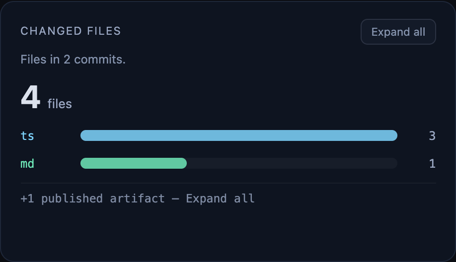

*Four files, and the description names where the number came from — `Files in 2
commits`, which you can check with `git show --stat`. Under the bars, the page this
session published: not a file that changed, so never part of the count.*

### The output row — Main tools · Commits · Cards

At 50/25/25: what the session ran to get there, what it shipped, and what it was
working on. All three are always on the page — a widget that appeared only once it
had content could not report that there is none, so Commits and Cards carry their
own empty state instead.

- **Main tools** shows the top output-size hogs at a glance; expand it to browse
  every tool call with a **live filter** (name or file path, instant) and a **sort
  toggle** (`size ↓` by output, `time ↓` by duration slowest-first). Every row
  shows the tool name, the turn it ran in, a proportional bar, and the value
  (chars or ms).

  The full list is **grouped by turn**, each group collapsed behind a header
  stating how many calls it holds and how much output they cost — so the question
  "which turn ate the window" is answered before you open anything. The size
  ranking lives INSIDE the group, which is what keeps the ranking and the
  chronology from having to fight over one list. Every row carries a `#N` fixed in
  the order the calls were made, so it does not move when you re-sort.

  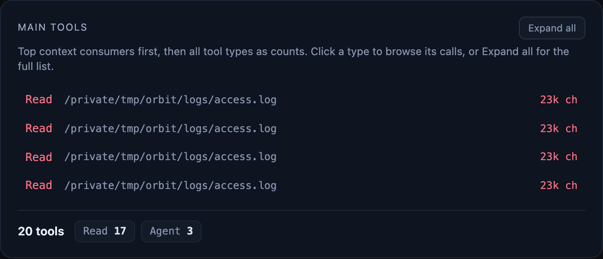

  *Four reads of the same file, 23k characters each, are most of what filled the
  window in the figure above — which is the kind of thing you only argue about once
  you can see it.*
- **Commits** — the commits that session produced, each opening on GitHub or
  GitLab, or marked `local` when it is not pushed. Attributed from the commit's own
  hash in the call that made it, so two sessions working on one repo never claim
  each other's work. Full rules: [`commits.md`](commits.md).

  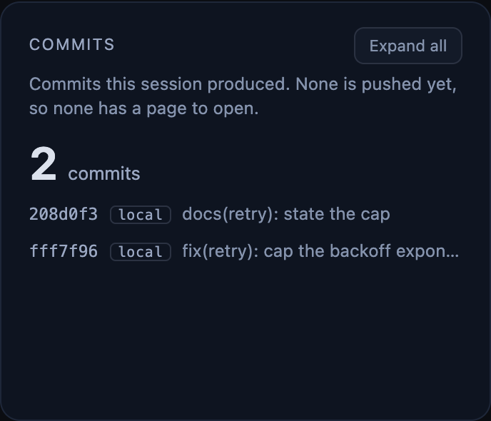

  *Two commits, and neither has been pushed — so the card says `local` rather than
  offering a link that would 404. The hash is the proof: it is the one the session's
  own `git commit` printed.*
- **Cards** — the tracker cards the session touched, each opening on its tracker.
  Read from the calls that named them, never from a key typed in a prompt: of the
  36 key-shaped prefixes appearing in prompts across a real corpus, 27 name no
  tracker at all (`GPT-4`, `UTF-8`). A row says whether the session **changed** the
  card or only **read** it. Full rules: [`cards.md`](cards.md).

  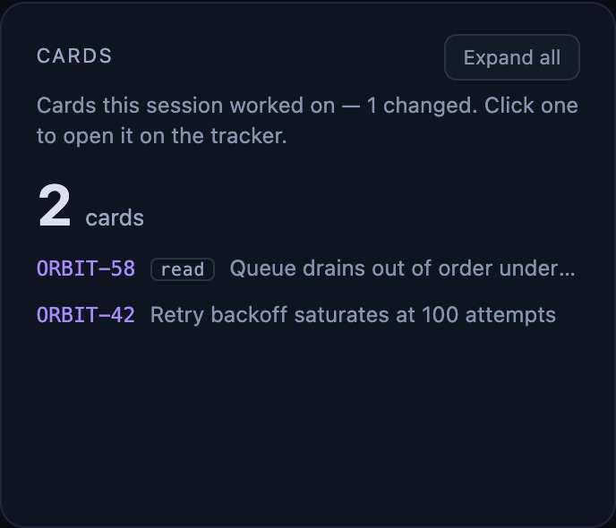

  *Two cards, and the difference is the point: one the session moved, one it only
  looked at — which the `read` badge says and the description counts.*

### The subagents grid

The full grid sits below, in launch order. Click a subagent to see its launch
prompt, the tools it called, and — the point — **the verbatim output it returned to
the main session**.

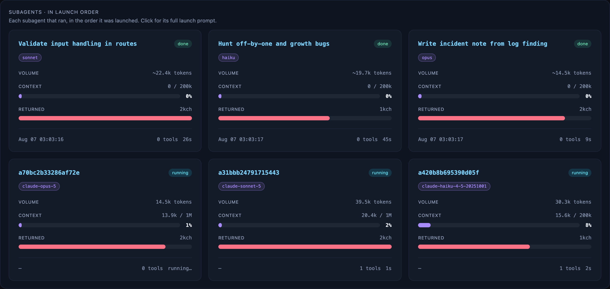

*Six subagents of one turn: the three that finished carry what they returned, the
three still working carry `running`. Each names the model it actually ran on, and
each is measured against that model's own window.*

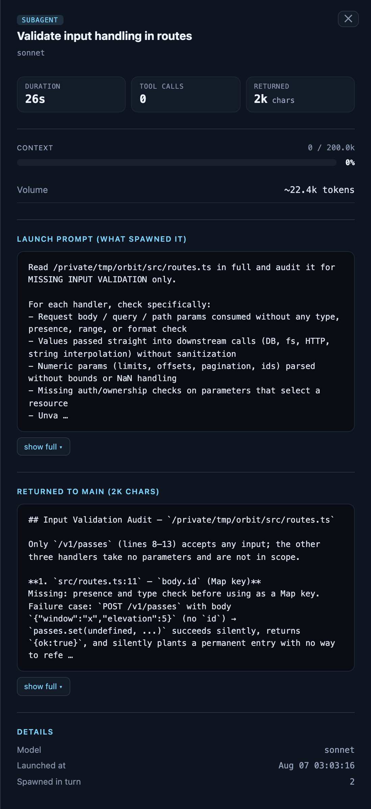

*The drawer, scrolled: what the parent asked it to do (`LAUNCH PROMPT`), and under
it `RETURNED TO MAIN` — the text the main session actually received, verbatim. This
is the one thing a transcript reader cannot reconstruct by eye, because the parent's
own log holds only the tool call and the result.*

A subagent appears the instant it is **launched** (not when its transcript shows
up) and stays `running` for as long as it really works — background subagents
included, which is now Claude Code's default. It ends as `done`, `failed` or
`killed`; `unknown` means seedeep never learned its fate rather than pretending to
know. A **workflow run** takes one aggregate row — fleet size, how many of its
subagents are still working, tokens, and the model breakdown — instead of flooding
the grid with the ~100 it spawns.

#### Background commands share that card

A session launches shell commands into the background as readily as it launches
subagents, and they used to have no catalogue at all — only a live list of the ones
still running. So a command that **failed** disappeared from every count the moment
it failed, which is the one thing you needed to be told.

The card holds both lists behind two tabs, and it grows them **only when both have
something in them**: with commands and no subagents (or the reverse) it is simply
the one list, with no switch to press. The tab you land on is always Subagents — a
default that moved on its own would leave you unsure what you were reading — and
the closed tab carries **its count and its failures on its own label**, so nothing
that needs attention is hidden behind an unmarked door.

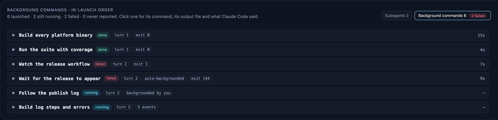

*The same card, switched to its other catalogue. The tab you are not on carries its
own count, and its failures with it — which is what makes hiding one list behind a
tab safe.*

A command reaches the background three ways, and the rows say which when it is not
the obvious one: the agent asked for it, **the call's own timeout** promoted a
foreground command that was still running (two minutes by default, and the agent can
ask for up to ten), or **you** pressed `Ctrl+B` and took it away from the agent. The first is what a background command already means to a
reader — it is 88% of them — so its rows stay bare; the other two carry a chip,
`auto-backgrounded` and `backgrounded by you`, on the live row, on the catalogue row
it becomes, and in the drawer both open. A command whose receipt is too old to say
which it was reads as the bare case: an omitted chip, never a wrong one.

Each command is one line: what it was launched to do (Claude Code's own
`description`, the name it quotes back when the command ends), its state, the turn
that started it, its exit code, and **how long the command itself ran** — launch
instant to the notification that ended it, which for a killed build can be hours.
A command still running has no duration to state, so it states its **age** instead,
ticking, exactly as the live row above does: one command described two ways on one
screen was a discrepancy, not a nuance.
The row's duration is never the launch call's, which closes in milliseconds and
measures nothing — and never the SECOND copy of the notification either: Claude
Code writes it twice, and the later copy is written when its queue drains, up to 76
minutes after the command actually stopped.

**A `Monitor` is one of these commands**, and for a long time it was the one thing
in the session you could not see at all. It is Claude Code's watcher — a `tail -f`
on a build log, a poll of a CI run — and it behaves like any background command:
armed once, running for as long as it watches, ended by a notification. What told
it apart was a field name. A background shell command names its task
`backgroundTaskId`; a monitor names the same thing `taskId`, so the gate that
recognises one never fired for the other. Everything downstream followed: the call
closed on its 0.1s receipt, it never entered this catalogue, never reached the chip
that says the session is still waiting on something, and never reached the tray.
Meanwhile the console counted it in the status line and seedeep said nothing.

**What ends a monitor is not what ends a shell command.** A background `Bash`
announces its own death twice over — a notification, and the moment it lets go of
its output file, which is what seedeep asks the machine when the notification never
comes. A monitor does neither: it holds no file open (measured on one that was
demonstrably alive), and stopping it writes no notification at all. What it does
write is the `TaskStop` itself — *"Successfully stopped task: …"*, naming the task —
and that sentence is what closes the row. Without it a monitor you stopped would go
on calling itself *still running* for the rest of the session.

A monitor also does something no other command does: it **reports while it runs**.
Every line its script emits is an event, and the row says how many have arrived and
shows the latest one under the title. Only the latest: one measured session
forwarded 74 events, and putting a stream into the activity feed would have left
room for nothing else there. The count is what tells a monitor that is working from
one that has been silent since it was armed.

Its drawer adds the full command, the sentence Claude Code wrote when it ended (the
only place the exit code exists) and the **output file** — the path where the
command's output was written. The notification that ends a command carries it in a
tag of its own, and the launch receipt carries the same path in prose (`Output is
being written to: …`) — on 198 of 198 background launches measured locally, which
is what makes it readable for a command whose end is never written at all.

**A scheduled wakeup shares the band, and it is not a command.** When a session paces
itself (a `/loop` with no interval), it arranges to wake itself up later — nothing
runs in the meantime, nothing holds a file open, there is nothing to probe. It is a
commitment, so it gets a row of its own, amber rather than green, saying when it will
wake and how long that is from now.

The row stops being drawn the moment its instant passes, and that is deliberate:
Claude Code writes **nothing** when a wakeup fires — no line, no marker that tells it
from any other system message — so seedeep can say what the session is waiting for and
never that it happened. A countdown running into the negative would be claiming a wait
that is over; saying "fired" would be claiming knowledge that is not on disk.

A command whose end **Claude Code never wrote** is the one row seedeep cannot read
off the transcript: 23 of 198 launches measured locally get no notification ever,
and the rule "launched, nothing said" means *still running* for as long as the
session stays open. seedeep asks the machine instead — nothing holding its output
file open means the process is gone — and the row reads **`unknown`** with its
duration as a bound (`≥ 4m 20s`, the last instant it was seen alive). Never `done`:
the check learns that something stopped, not what it stopped with. The mechanism,
and the two sources that were measured and refuted before it, are in
[`docs/architecture.md`](architecture.md#is-a-background-command-still-alive).

The cockpit above keeps its half of the job, and only that half: it draws **what is
still running**, and nothing else. A command that failed or was never reported is
*counted* there and never drawn — the line reads `2 commands failed below · 1 never
reported below`, the same way that card already points at a subagent that has
finished. Rows for the dead were tried and refused:
on a session whose commands had all ended, a card headed LIVE listed two corpses,
which is the same kind of lie as the disappearance this feature exists to fix. The
count is what keeps the failure from vanishing in silence; the catalogue below is
where it is actually stated.

Every entity — subagent, tool call, tool type, API call, skill — opens a **detail
drawer**; drill-down clicks (e.g. a tool inside a subagent's drawer) show a
**breadcrumb** so you can navigate back without losing context.

The view reconstructs identically live and in replay; an **ended** session drops
the live chrome — the monitor collapses to a one-line summary, and the LIVE badge
yields to a quiet "ended".

## The turn as a lens

The **Timeline**, the strip across the top of the session, shows **everything you
sent** — typed prompts and slash commands alike — and colours each entry by what it
actually cost: a round of work (green
while it is burning tokens, red if you hit Esc), a context event (`/clear`,
`/compact`, a compaction), or a local command that cost nothing.

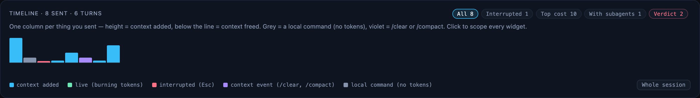

*One column per thing you sent, and the colour is the cost: green while a turn burns
tokens, **red** where Esc cut one off, **grey** for a local command that cost nothing,
**violet** for a `/compact`. The filter chips above count what is worth filtering to.*

Click one and **every widget re-scopes to it**: context, token usage, tools,
subagents, skills, commands, and the activity feed. Prompts and results open in
full, rendered as markdown. An interrupted turn is the point of the whole view:
everything it consumed, and no answer to show for it.

## A verdict on every turn, both faces

Seven deterministic checks (no LLM) score each turn for waste — a subagent that
returned a large output, a mid-turn compaction, a second Esc in a row, a **cold
resume**, a context window ≥70% full, an **exploration** that read many files and
changed nothing, or code **committed with no check** run anywhere in the session.

Every check quotes the public Claude Code documentation that justifies it —
including the one that says a *single* Esc is the recommended behaviour, not waste.
No check compares a turn to your other turns: one did, and measuring showed it
reported how BIG a turn was, which is not the same as waste.

The resume check is the one that separates *what a turn did* from *what it paid to
come back*: a turn re-opened long after the cache went cold re-creates its whole
prompt before doing anything — measured on a real corpus, that is a quarter of
every token spent, and it used to be reported as if the turn had done the work.

The verdict also names what a turn did RIGHT: ran a check before committing,
delegated the exploration to a subagent, had its work reviewed by one. A wasteful
turn raises a non-blocking toast the moment it closes; the timeline's **Verdict**
lens then dims every other column and lists, per turn, what went wrong, what it
cost, and what went well.

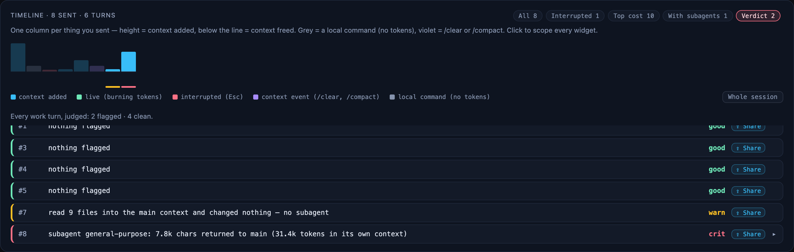

*The lens dims everything else and names what each flagged turn did: one read nine
files and changed nothing, the next pulled a **7.8k-character** subagent report into
the main context. Both are lower bounds — a check says only what it can prove.*

### One turn, as a card you can post

**⇪ Share** — on every row of the lens, and on the banner of a turn you have scoped
into — renders that turn as a PNG: what it spent, that figure against the p50, p90
and p95 of its own bucket, every finding with its price, what it did right, and a
strip of what the turn actually DID (API calls, tool calls, subagents, tokens
re-read from cache, the model and its effort). A verdict with no activity behind it
is unreadable to anyone who was not in the session. With too few turns to have a
baseline, the card says exactly that instead of inventing a multiple.

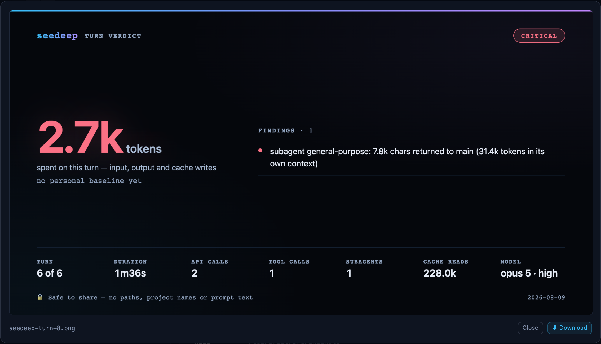

*The card of the turn the lens flagged, in the preview that opens first: **⬇ Download**
is a separate click, so a card you did not mean to make never reaches your disk. The
button belongs to the turn it sits on, never to whatever the view is scoped into —
the turn you are reading is always the turn the card describes.*

**Nothing in the card can name your work**, and it says so along its own foot: no
prompt, no file path, no project or session name — the only word that comes from
your setup is the *type* of a subagent a finding quotes (`general-purpose` above).
That is what makes it postable without a review pass over it first.

The page draws its own PNG, from the data it is already showing: no server, no second
browser, nothing sent anywhere — which is also why it works from the compiled
executable, where a headless Chrome could never be bundled.

## When a session is waiting for YOU

A session stopped at an approval dialog (or an `AskUserQuestion`) is normally
indistinguishable from an idle one — nothing about it reaches the logs. seedeep
reads it from Claude Code's own live session state and shows it: the tab dot turns
**amber**, an amber toast announces it, and the Live activity's NOW panel says what
it is waiting to approve and for how long — clearing itself the moment you answer.
seedeep only *shows* it; it never answers for you.

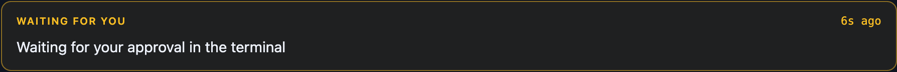

*Amber means the session cannot move until you do, and the age keeps counting so a
minute lost is a minute you can see. This state is the one thing in seedeep that
comes from outside the transcript — it is in Claude Code's live session file, which
is why a stopped session looks exactly like a thinking one everywhere else.*

## When a session is BROKEN

An API call that fails — an expired login, a session limit, an overloaded server —
ends the turn and leaves the session sitting there. It is the quietest failure
there is: measured over 1830 real transcripts, 39 of 47 failed calls were the last
model line their session ever wrote, and nothing on screen says so.

seedeep makes it a state rather than a passing message: the tab dot turns **red**,
the menu-bar icon turns red above every other signal, the tray panel files the
session under **Broken** with the message Claude Code itself showed, and a
notification says which session broke. It clears itself on the next call that
succeeds — never on a timer.

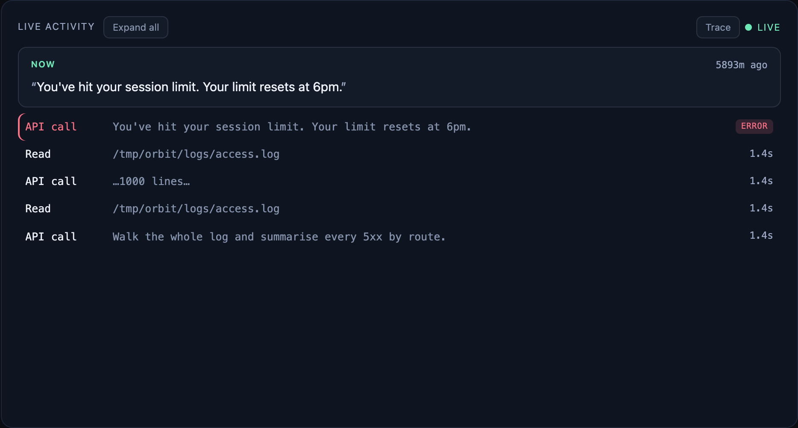

*The last thing this session ever wrote. The message is Claude Code's own, verbatim —
seedeep never paraphrases what failed, because the wording is what tells you whether
to wait, log in again, or switch model.*

## Failures stand out

A tool that failed or an API call that errored (rate limit, auth, prompt too long)
carries a red badge wherever it appears — the Live activity feed, both Expand-all
lists, and the drawer — and reddens its Trace span, with a folded round/chapter
flagged red so a failure buried in a collapsed group is still visible. A tool the
*user* refused (an Esc on the permission prompt) is not a failure and is never
flagged.

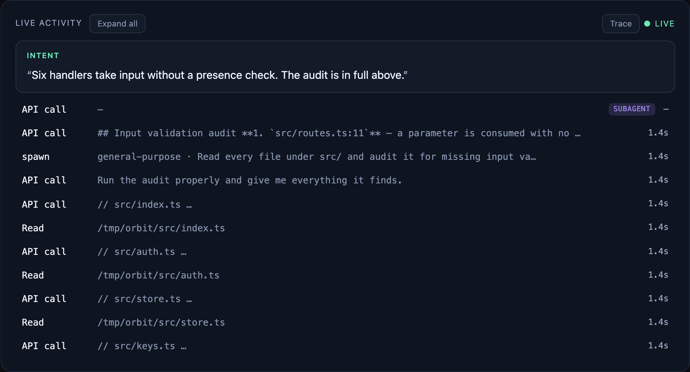

*The badge sits on the row itself, so a failure is visible without opening anything —
and the call after it succeeded, which is why this is a badge and not a session state.*

## When something else has a warning for you

Hooks and plugins can attach text to a session, and it is text nobody generated for
your benefit twice: a security plugin objecting to what was just written to a file, a
background review reporting what it found. In the transcript it lands among the
bookkeeping every tool produces, and seedeep used to drop all of it — which meant a
real warning about a real file could pass through a session and leave no mark on any
surface.

It now shows up where it belongs, and *where* depends on what it is about:

- **A note about one call** — the common case, and the security plugin about a `Write`
  or an `Edit` is nearly all of it — marks that call. A ⚑ on its Trace block, a chip in
  its drawer, and the text itself in the drawer, verbatim, above the call's own
  arguments. It is a warning about what that call did, so it sits with the call and
  nowhere else.
- **A note about the session** — work that ran with no call of its own, like the
  background security review — goes into the activity feed, because there is no row it
  could be attached to. Pinning it on whichever call happened to be open would be an
  invention. The feed is a glimpse, though: it holds thirteen rows per turn, and a
  finding you have to catch within ten activities is one you will miss. So the note is
  **also in Expand all**, the turn's complete history and the one list with no cap — in
  time order, which lands it right after the call that provoked it. It is the only row
  there that is not a call, so it is named in amber and carries no duration.

Either way the whole text is one click away: a row shows one ellipsized line, the
drawer behind it shows what was written, verbatim.

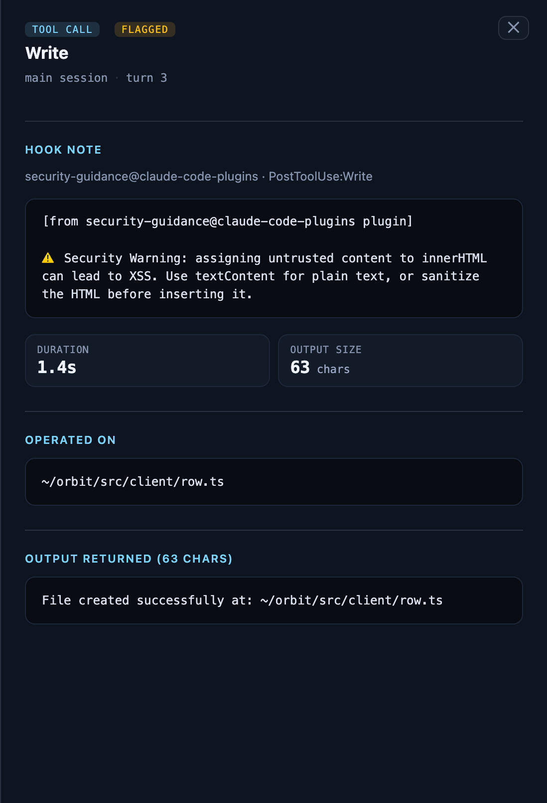

*The note sits above the call's own arguments, because it is about what that call did.
The chip in the eyebrow is what tells you there is something to read before you open it.*

Nothing here is modelled as "a security finding". What the transcript records is that
something had text to say, and the writer names itself in it — a plugin, a hook you
wrote yourself. A feature keyed on one plugin's name would go blind the day another one
speaks.

The marks are amber, never red: a call somebody warned about is not a call that failed,
and the two can be true of the same row at once.

## Nothing is hidden from you

The Live activity card streams the most recent events, but it can only hold a
dozen — and on real sessions that is the *median* turn, so about half of them have
more. **Expand all** opens the complete list: every prompt, API call, tool, skill
and spawn in the order it happened, with each subagent's own work indented under
the spawn that launched it, filterable, and scoped to whatever turn you have
selected. Every row opens the same detail drawer as the rest of the app.

Across the whole session that list is thousands of rows, so it arrives **grouped
by turn**: one collapsible header per turn saying how much is inside, and only the
most recent one open. Nothing is hidden — a group builds its rows the moment you
open it, and typing in the filter opens every group that has a match. What you
opened stays open: following a row into its detail and coming back by the crumb
returns you to the list as you left it — and until you open one yourself, the
newest turn is the one that greets you, however far the session has moved on.
Scoped to a single turn there is nothing to group by, and the list stays flat.

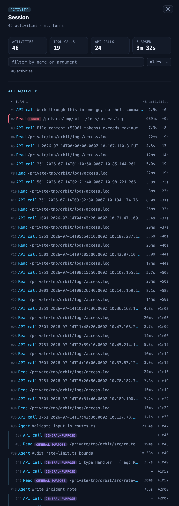

*Forty-six activities where the card itself holds twelve. The three `Agent` rows
are spawns, and what each subagent did sits indented underneath — its own API
calls and reads, tagged with the agent type, in the order they happened.*

## Trace — the whole session as one flow diagram

Opened from the Live activity card: a vertical spine of turns, each expanding in
place into the strip of what actually happened.

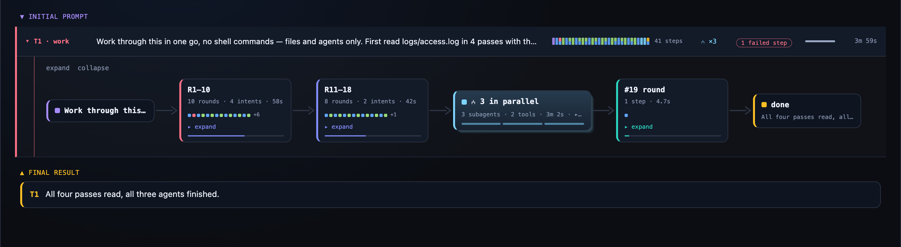

*One turn, 41 steps, and none of them hidden: the two grey blocks are chapters —
`R1–10` and `R11–18` — that expand in place, while the landmarks stay out where you
can see them. The teal block IS the spawn of three parallel subagents, the red edge
on the first chapter is the failed step inside it, and the row above says `1 failed
step` so a failure folded into a group is still visible from outside.*

Built to stay readable at real scale (a p99 turn has ~200 steps): consecutive
rounds of work fold into **chapters** you expand in place, while the landmarks —
spawns, skills, replies — always stay visible. Live, the newest block glows and the
view follows it; a spawn block IS its subagent (launch intent, tools, real
duration) and unfolds the child's own flow as a parallel lane below, filling
**while the agent runs**. Every block clicks through to the same drawer as the rest
of the app. The full rules live in [`trace.md`](trace.md).

## Home — your retrospective, from minute zero

First entry of the header menu (☰, left of the wordmark), never closable, and
filled before you run anything: it reads the sessions already on disk, so an empty
workspace never looks like a broken page.

It answers *how do I actually use this agent* — your median turn against its p95,
the tokens spent (the COMPLETE figure, cache reads included, because those are
billed too), API calls, how many turns wasted tokens, what you abandoned to Esc,
and the hours you spent working.

The hero is the **turn-size distribution**: the shape of how you spend new tokens,
with your p50 and p95 marked on it. Alongside, **activity** follows the time
filter: `7d` draws one bar per day ("6d ago → today"), `30d` one bar per calendar
week over the last ~30 days, and all-time the full weekly cadence — readable three
ways from tabs in the card: `tokens` (the volume of work), `turns` (split crit /
warn / clean), and `hours` (time actually worked).

Below: where the waste comes from, tokens split by the model that spent them
(**subagents counted under their own model**, so a Haiku explorer inside an Opus
session shows up as Haiku), tool calls by type, and the verdict split. A
`7d / 30d / all` filter switches window instantly — all three ride in one response,
nothing refetches. A persistent, incremental cache keeps the tab instant: a full
corpus scan takes seconds, which is too slow for a launch surface, so only what
changed on disk is ever re-read.

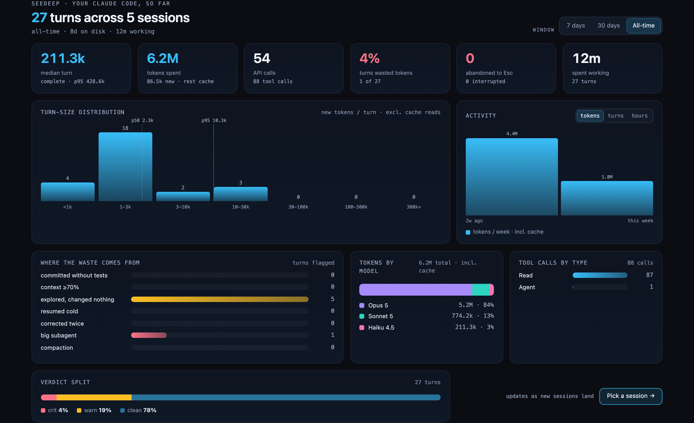

*Your own numbers, before you run anything: the shape of how you spend new tokens with
your median and p95 marked on it, and underneath, where the waste came from.*

## Compare — which session weighed the most

The menu's second surface ranks your sessions against each other over a time
window (`7d / 30d / all`), in tokens **weighted by model** rather than counted
flat: an Opus token and a Haiku token are not the same thing, and the raw total is
97% cache re-reads, so an unweighted ranking just sorts by how long a session
stayed open.

A row is three stacked lines — the prompt, every fact about the session on one line
(project, the model its main thread ran on, when it ran, calls, the complete token
count with cache reads included, the subagents' share), then the bar at full
width — and the bar carries two facts at once: its length is the session's weight,
its segments are the model mix, so *how heavy* and *why* are one object.

Sessions the weighting moved by 3 places or more say so (`▲N vs unweighted`), the
sessions below the cut are still summed rather than quietly dropped, and **clicking
a row opens that session's own tab**, so the leaderboard is the way in and not just
a report.

The weights per kind of token are Anthropic's own published burndown rates; the
ratio between models is derived from the price list and marked as ours, since
Anthropic publishes none. It is a **token count, never a cost in dollars**, and it
never invents an "equivalent" unit — a permanent *how this is computed* block
explains the number instead of a label nobody could interpret.

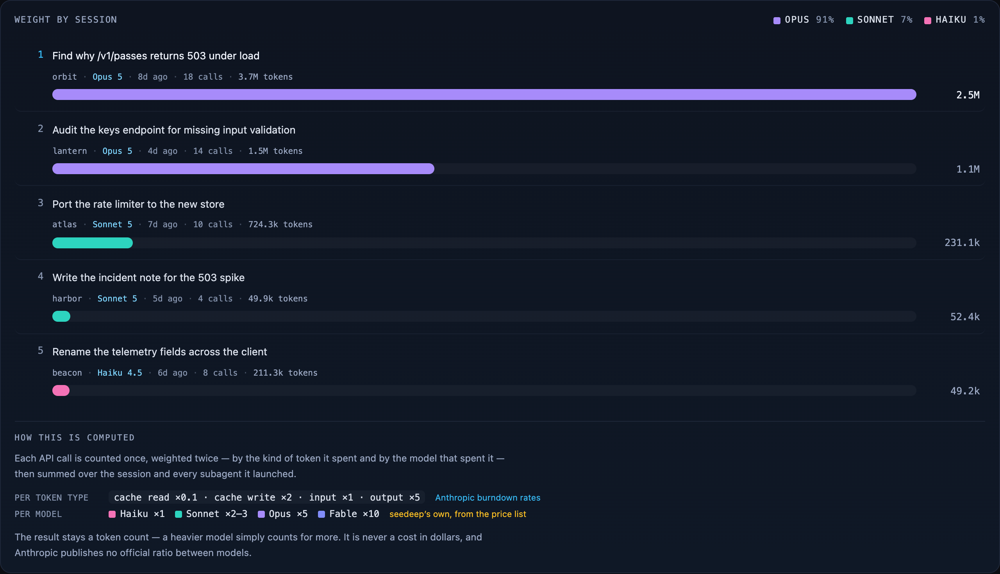

*Each bar says two things at once: its length is the session's weight, its segments are
the model mix — so the Haiku session's 106.6k tokens weigh less than the Sonnet one's
27.5k. The permanent *how this is computed* block is there because a number nobody can
interpret is worse than no number.*

## Search — find the session that solved it

The menu's third surface: type the two or three words you remember and get the
sessions whose **dialogue** holds all of them — your prompts and Claude's answers,
never the raw transcript (injected instructions, system reminders and tool results
match twice as often and say nothing about what a session was for). Every word is
an AND term.

Rows are ranked by **density** — occurrences per 1k characters of dialogue —
because ranking by raw occurrences ranks session *length*: the longest session wins
a query it barely touched, while the short one that was entirely about it sits
fifth. `occurrences` and `recent` are one click away, and each order sorts by the
number the row prints.

Paste a **commit hash** instead and the search also asks git which session produced
it — the hash of a commit lives in the output of the command that made it, which
the dialogue index excludes, so the session that did the work is exactly the one
text search misses (measured: 29% of commits). Same rows, same order, only more of
them. A **tracker id** (`ABC-12`, `#42`) works the same way and for the same
reason: a session can work a card for an hour without ever typing its key, because
the id lives in the tool call. That one is answered from its own index — 68 ms over
716 sessions — and a text search never pays for it.

Each row shows the passages that matched, attributed to **you** or **claude** and
highlighted, and carries two ways out: **open the session in a tab**, or take its
**full session id** — spelled out on the row, one click to copy — for
`claude --resume`; the same chip makes the picker's id copyable too. Automated
`sdk-*` runs are kept aside behind a control that states its own count, never
dropped, and nothing is truncated. The index is seedeep's own file, incremental and
built on demand: ~20 MB of dialogue over a thousand sessions, tens of milliseconds
per query. Full rules: [`search.md`](search.md).

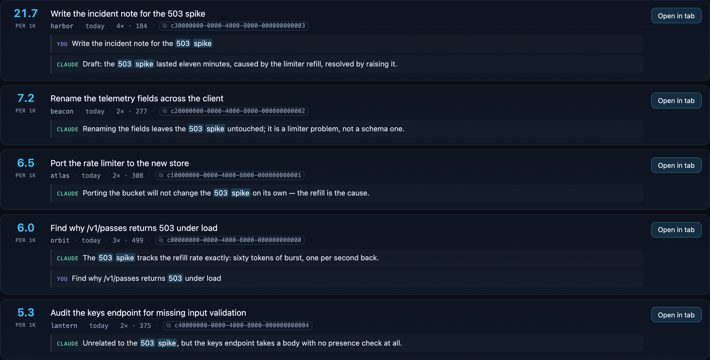

*Two words, and the ranking is the point: the SHORTEST session is first, because it
mentioned them once in very little dialogue. Ranking by raw occurrences would have put
the longest session on top, which is how a search comes to answer with the session you
were not looking for.*

## The menu-bar tray

The same signal where you are already looking. The icon **turns while a session is
working**, goes **amber, and still, the moment one stops and needs you**, and
**red when one of them breaks** — motion means *running, nothing for you to do*, so
the thing you can act on is the thing that holds still, and a session whose call
failed outranks one merely waiting, because an approval resumes the instant you
answer it and a failed call does not resume at all.

A notification when either happens, and optionally one when a session finishes,
with the agent's last words. A click opens a small panel of your live sessions
ordered by urgency — **Broken**, *Needs you*, *Working*, *Idle*: what each one is
asking for or what failed, what it says it is doing, its newest call, how full its
context is. Only the sessions a person is actually in — headless `claude -p` runs
never appear.

It is a **pure HTTP client** of the same API the browser uses: it parses no
transcript and owns no reducer, so the meaning it shows is the server's, computed
once. What it does hold is a handful of presentation rules copied deliberately —
chiefly *what counts as waiting on you* — each pinned to the server's by a test,
because a client that links no code cannot import one.

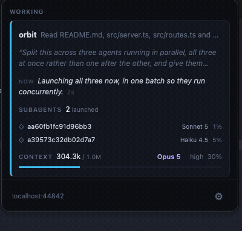

*The same session as everything above, from the menu bar — the one surface that is a
recording rather than a crop, because the tray is a native app and not a page.*

Packaged by CI from a tag into a universal DMG and a Windows `-setup.exe`,
**unsigned**. **Verified on macOS only** — see [Which platforms have actually been
run](../README.md#which-platforms-have-actually-been-run), because this project
does not call a thing measured when it has not been. Full rules:
[`tray.md`](tray.md).

## Local by default, remote on purpose

The server listens on `127.0.0.1` until you say otherwise. Name any other host and
the posture changes as a whole: HTTPS on a self-signed certificate whose
fingerprint is printed on every start and copyable from the settings panel, so a
client that cannot click through a browser warning can pin it, and a Bearer token
on every API route.

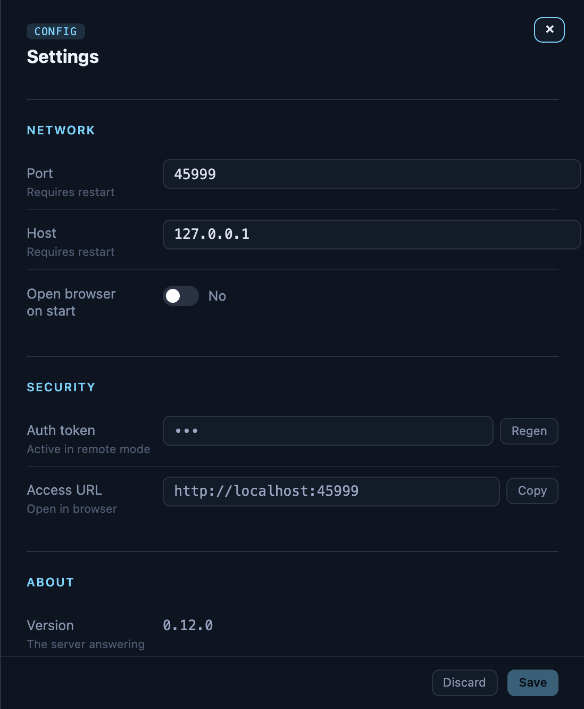

*The panel as every install starts: bound to `127.0.0.1`, so the token is inert
and there is no certificate to pin — the TLS block appears only once you name
another host. **Version** is the server that answered this request, not the one
you installed.*

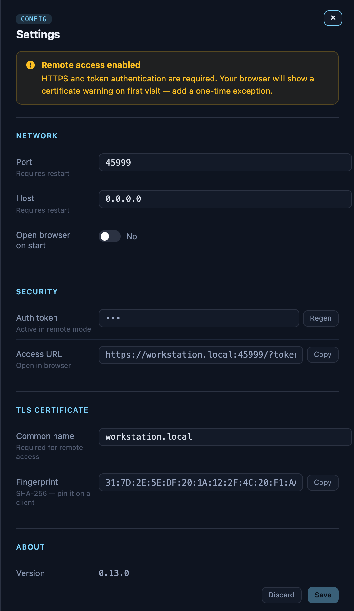

*The same panel with the host named — the whole second posture in one picture. The
banner is the warning that the browser will meet a self-signed certificate; the
**Common name** is what that certificate is issued for; while it is missing or
unusable nothing in the panel is written at all, so a remote host cannot be
stored without one. The **Fingerprint** is what a client that cannot click a
warning away has to pin. It is the RUNNING server's certificate, so it fills in only
after the restart, and the access URL turns `https` and carries the token. Turning it
on: [`install.md`](install.md#remote-access).*

That version is beside the wordmark too, on every portal — it is the number a bug
report quotes, and it says which of two seedeeps you are looking at. A portal served
from a **checkout** says so as well, with a `dev` chip and a browser tab reading
`seedeep dev`: both watch the same sessions (the transcripts belong to Claude Code,
not to seedeep), so a dev portal and an installed one show identical content, and the
tab you are about to change a setting in would otherwise be a coin toss. A released
build carries no chip — a badge present on every install is a badge nobody reads.

Configuration lives in `~/.seedeep/config.json` — CLI flag over environment
variable over file over default — and the settings panel edits it in place. No
tunnel ships with `seedeep`: an SSH port-forward or a VPN already solves that, and
re-solving it would only add a second, weaker way in. How to turn it on:
[`install.md`](install.md#remote-access).

**A server keeps the port, host and certificate name it started with**, so a config
changed since — in the panel or in an editor — is a file saying one thing and a
process doing another. An amber dot on the Settings button says so with the panel
closed, and the panel explains it with the button that ends it; the tray says it above
its sessions and `seedeep status` prints it. It is the SERVER's comparison, against
what a fresh start would resolve to rather than against the file alone: a port pinned
by `--port` is not pending, because a restart would go on ignoring the file there too.

## The engine underneath

- **Core engine** — read-only, runtime-agnostic watcher + parser: session
  discovery, incremental tailing, and a normalized per-session event stream
  (context fill, attribution, compaction, subagent tree).
- **Local server** — serves a page and streams live events to the browser over a
  single multiplexed SSE feed, plus a read-only session roster and a read-only
  replay stream for finished sessions.
- **GUI shell** — one tabbed page (the workspace above), with **replay** for
  finished sessions and a per-tab subscription over the shared feed, so a dozen
  open tabs still cost one connection and closing one leaks nothing.

## Notifications

seedeep tells you when a session **stops on you**, when one **breaks**, and — if
you ask for it — when one **hands the turn back**. The server decides all three:
it holds the transitions, the switches and the wording, so a banner and the panel
row it belongs to can never describe one event in two ways.

Each **delivery channel has its own switches**. The same moment can be worth a
banner on the machine you are sitting at and not worth a push somewhere else, and
one shared set cannot say that. The tray's four are edited from its own panel; the
webhook's from the portal's Settings.

The **webhook** is off until it has a URL, and it is the only thing in seedeep
that sends session data off the machine (see `install.md`). It POSTs to any
address with your headers and your template — `{{title}}`, `{{body}}`,
`{{project}}`, `{{subject}}`, `{{kind}}` — so ntfy, Pushover, Telegram or a script
of your own all work without seedeep knowing any of them. A URL on its own is
already a working webhook: an empty template posts the body. It never retries: a
missed notification is better than one replayed minutes late.

A turn that ends says **`Turn finished`**, not "finished" — the session has not
ended, it has become yours again. A turn **you** interrupted is never announced:
if you pressed Esc you already know.
